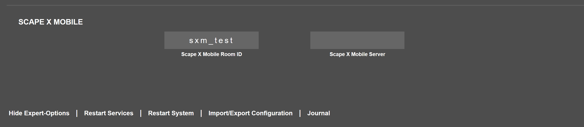

# Scape X Mobile Web

With this package it is possible to create a web app which enables your smartphone to get uniquely identified on a Scape X Mobile enabled touch table. 


## Installation
Install via npm
```
npm install sxm-web
```

## Usage
The least thing you need to do is to create an instance of `SxmSession` and call the `start()` method.

```js
const session = new SxmSession();
session.start();
```

You can register four callbacks on the `SxmSession` object:
- `onStart`: is called when the touch table has connected to the mqtt server.
- `onShutdown`: is called when the touch table has disconnected from the mqtt server.
- `onDown`: is called when the device is placed on the touch table.
- `onUp`: is called when the device is lifted from the touch table.

## How does it work?
First the `sxm-web` package creates an unique id (`uuidv4`) for your device. It uses the gyroscope of your smartphone to get informationen about whether your phone is moving or not and if your phone is horizontal or tilted. It establishes a connection to a MQTT broker and together with the unique id it sends the motion information to this server.

The Scape X Mobile enabled touch table is capable of detecting smartphones. But without information from the web app it is not possible to assign unique ids to each smartphone. So by default every detected phone on the table gets an ID of `-1`. 

The table also communicates with the same MQTT broker. As soon as it gets a message which says that a phone is horizontal and not moving it checks if it has detected a smartphone recently which has no specific unique id. If so, this smartphone gets the unique id which the web app has sent. Now it is possible to assign unique ids to each smartphone which has the web app open.

### How does the web app know about the MQTT broker and which table it should send the information to?

Each table by Interactive Scape has a web ui where you can configure your Scape X Mobile settings.



- `Scape X Mobile Room ID`: is a unique ID for the touch table. By default it has the hardware-id. If you want a more readable or more descriptive name you can set your own.
- `Scape X Mobile Server`: here you can specify the server url for the MQTT broker (`my.url.com:port`). By default we use the public MQTT broker by [hivemq](https://www.hivemq.com/mqtt/public-mqtt-broker/) (`broker.hivemq.com:8884`)

You can pass these information with custom parameters in the url of your web-app. 
- `r`: defines the roomId. This parameter is mendatory.
- `u`: **Optional** defines the url of the MQTT broker. (Default: `broker.hivemq.com:8884`)

The url to your web-app could look like: `my.webapp.com?r=testRoom&u=broker.test.com:1234`

How you provide this link is up to you. We like to show it as an QR-Code in the application running on the touch table which makes it easy for customers to scan it to access the webapp.

